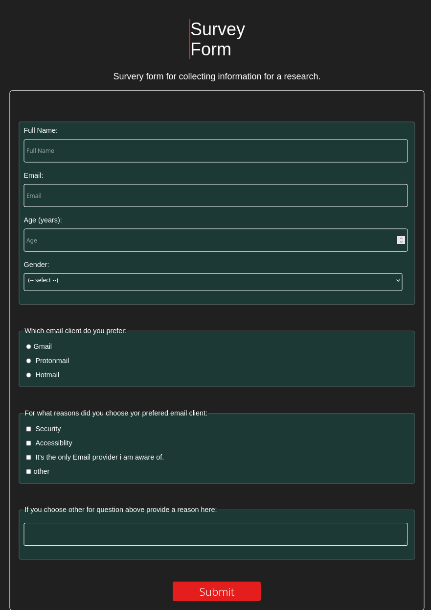

# Survey Form

## Description

This is the first milestone project in the [freeCodeCamp](https://www.freecodecamp.org) [Responsive Web Design curriculum](https://www.freecodecamp.org/learn/2022/responsive-web-design/). 
Here are some concepts i applied when i build this project:
* HTML semantics
* Reusable Layouts in css

## About

This form serves to collect data about which email client is used by most people and why. 

### Thankyou for visiting.
